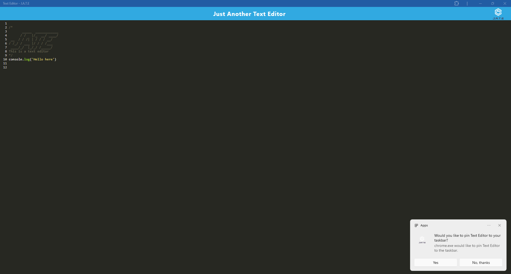
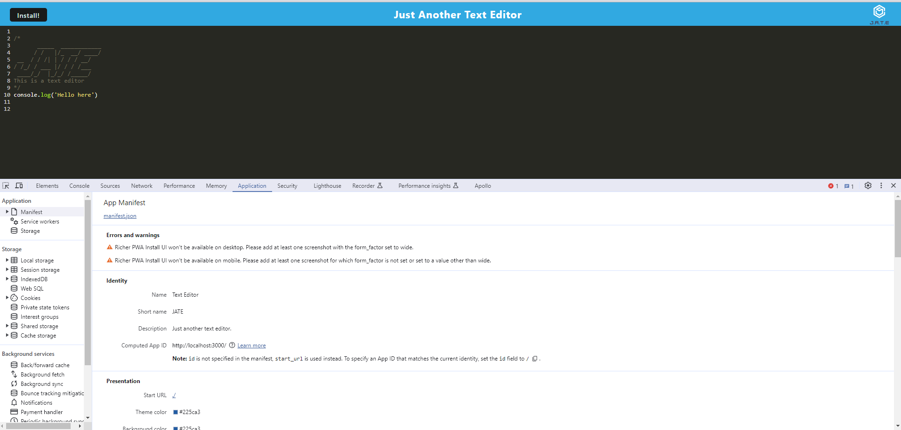
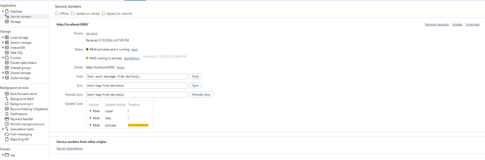
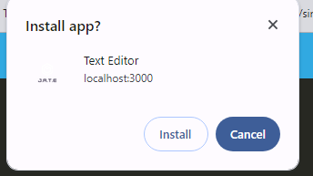
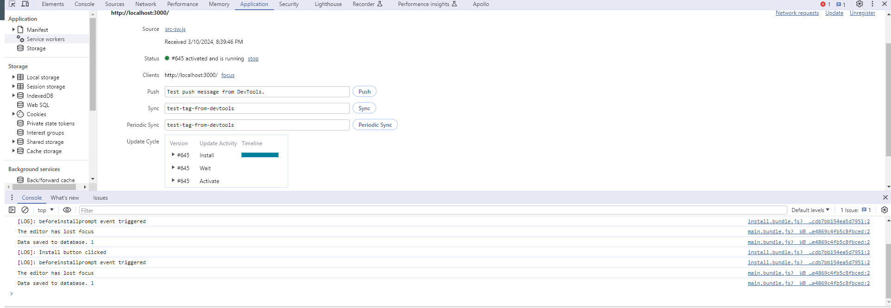
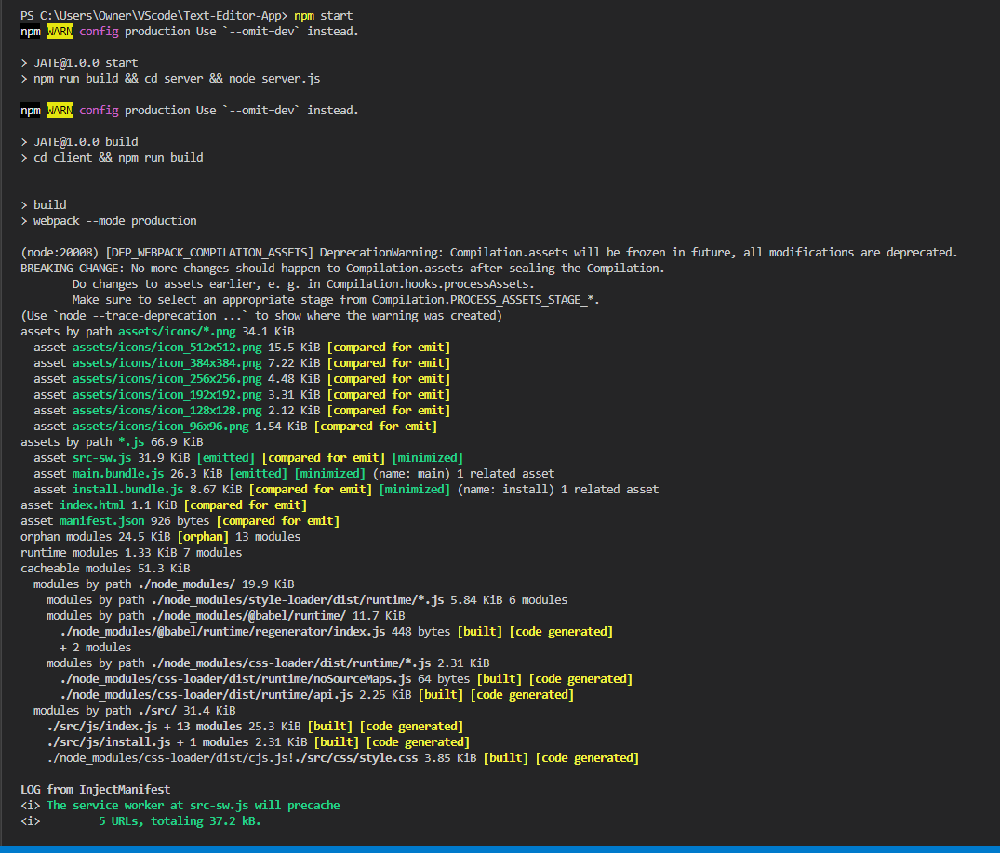
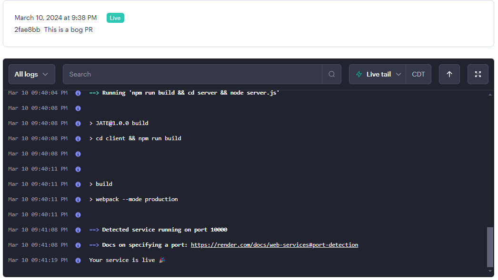

# Offline Text Editor

## Overview
This project is a text editor web application that allows users to create notes or code snippets with or without an internet connection. The application uses IndexedDB to store the content locally, ensuring that it can be reliably retrieved for later use.

## Features
- Create and edit notes or code snippets
- Store content locally using IndexedDB
- Works offline
- Webpack bundling for JavaScript files
- Service worker for offline functionality
- Manifest file for installation as a desktop application
- Deployable to Render

## Getting Started
1. Clone the repository.
2. Navigate to the root directory of the project.
3. Run `npm install` to install dependencies.
4. Run `npm run start` to start the backend server and serve the client.
5. Open the application in your browser.

## Usage
- Enter content in the text editor.
- Click off the DOM window to save the content to IndexedDB.
- Close and reopen the text editor to retrieve the saved content.

## Deployment
- Deploy the application to Render using proper build scripts for a webpack application.
- link: https://text-editor-app-57y5.onrender.com

## Technologies Used
- JavaScript
- IndexedDB
- Webpack
- Workbox (for service worker)
- Render (for deployment)

## Contributors
Starter code by Xander Rapstine

## View

     

